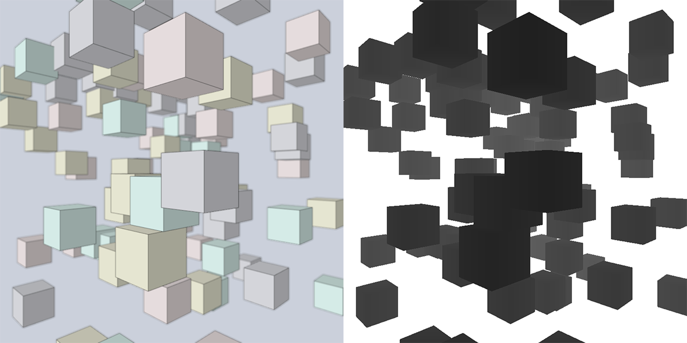

  Examples showing how to use Processing's PGraphics depth buffer as input for shaders, without CPU read back. This should be easier and faster than rendering the scene a second time with a depth drawing shader, and make certain post processing effects, like Depth of Field and SSAO, cheaper to compute.

  A Depth of field example is included as well. Contributions are very wellcome.

  

  If you find it useful for your professinal practice, please consider donating

